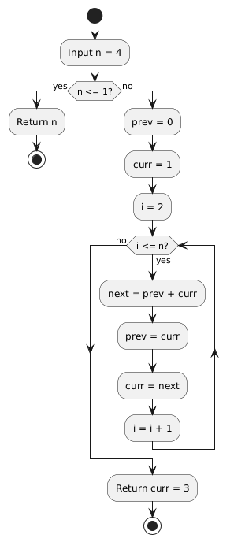

## 1. Introduction

The Fibonacci series is one of the most famous numerical sequences in mathematics and computer science.  
It appears in many real-world applications such as algorithm design, data structures, nature patterns, and problem-solving techniques.

In programming, the Fibonacci series is commonly used to understand:
- Looping concepts
- Function calls
- Recursion
- Time and space complexity comparison

### Real-World Applications
- Used in algorithm analysis to explain recursion and dynamic programming
- Applied in data structures like trees and heaps
- Seen in nature patterns such as leaf arrangement and shell spirals
- Used in financial models for trend and ratio analysis
- Helpful in teaching problem-solving and optimization techniques


---

## 2. Definition of Fibonacci Series

The Fibonacci series is a sequence of numbers where **each number is the sum of the previous two numbers**.

### Mathematical Definition:
- F(0) = 0  
- F(1) = 1  
- F(n) = F(n−1) + F(n−2) for n ≥ 2  

### Example:
0, 1, 1, 2, 3, 5, 8, 13, 21, ...


---

## 3. Methods to Generate Fibonacci Series

There are two commonly used programming approaches:
1. Iterative Method
2. Recursive Method

Each approach has its own advantages and disadvantages.

**Dynamic programming bridges these two approaches** by combining recursive problem decomposition with iterative-style reuse of previously computed results (memoization/tabulation).

---

## 4. Iterative Approach

### Concept

The iterative approach generates the Fibonacci series using **loops** such as `for` or `while`.  
It calculates each Fibonacci number step-by-step and stores only the required values.

### Working Principle
- Initialize the first two numbers
- Use a loop to calculate the next terms
- Update values in each iteration

### Pseudocode
```

FibonacciIterative(n):
  if n == 0:
    return 0
  if n == 1:
    return 1

a ← 0  
b ← 1  

for i ← 2 to n do  
   c ← a + b  
   a ← b  
   b ← c  
end for

return b   // nth Fibonacci number


```

### Flowchart: Iterative Fibonacci



*The flowchart illustrates the iterative process for finding 4th Fibonacci number.*

### Advantages
- Faster execution time
- Uses less memory
- Simple and efficient for large values of n

### Disadvantages
- Logic may look less mathematical compared to recursion

---

## 5. Recursive Approach

### Concept

The recursive approach uses **function calls** where a function calls itself to calculate Fibonacci numbers.

### Working Principle
- The recursion stops at **base cases** (`n = 0` and `n = 1`)
- For other values, the function calls itself to compute the two previous Fibonacci numbers
- The final value is obtained by adding results of smaller subproblems

### Pseudocode
```

F(n):
  if n == 0:
      return 0
  if n == 1:
      return 1
  return F(n-1) + F(n-2)

```

### Recursion Tree: Recursive Fibonacci

```text
F(4)
├── F(3)
│   ├── F(2)
│   │   ├── F(1) = 1
│   │   └── F(0) = 0
│   └── F(1) = 1
└── F(2)
  ├── F(1) = 1
  └── F(0) = 0
```

*The recursion tree for F(4) shows repeated subproblems (for example, F(2) is computed multiple times), which causes inefficiency in naive recursion.*

### Advantages
- Simple and close to mathematical definition
- Easy to understand conceptually

### Disadvantages
- Slower execution time due to repeated calculations
- Uses more memory space (stack calls)
- Inefficient for large values of n

---

## 6. Comparison: Iterative vs Recursive

| Feature | Iterative Approach | Recursive Approach |
|---------|-------------------|-------------------|
| **Execution Speed** | Fast – computes each term once in a single pass | Slow – recalculates the same subproblems multiple times |
| **Time Complexity** | O(n) – linear growth with input size | Θ(φⁿ) where φ ≈ 1.618 – exponential growth due to overlapping subproblems |
| **Space Complexity** | O(1) – uses only a fixed number of variables | O(n) – requires stack space proportional to recursion depth |
| **Memory Usage** | Low – no additional stack frames needed | High – each recursive call adds a new frame to the call stack |
| **Risk of Integer Overflow** | Present for very large n with fixed-size integer types | Present for very large n with fixed-size integer types |
| **Risk of Stack Overflow** | None – no recursion involved | High – deep recursion for large n can exceed stack limit |
| **Scalability** | Highly scalable for large values of n | Not scalable – becomes impractical for n > 30–40 |
| **Function Call Overhead** | None – all computation happens within a single function | Significant – each call incurs overhead for stack management |
| **Suitability for Optimization** | Already optimal for basic Fibonacci | Can be optimized using memoization or dynamic programming |
| **Best Use Case** | Production code, large inputs, performance-critical applications | Teaching recursion concepts, small inputs, algorithm demonstrations |

### Key Insights

- **For practical applications**, the iterative method is almost always preferred due to its efficiency and predictable performance.
- **For educational purposes**, the recursive method helps students understand the concept of breaking problems into smaller subproblems.
- **Dynamic programming acts as a bridge** between recursion and iteration: memoization preserves recursive thinking, while tabulation follows an iterative build-up.
- **Optimization techniques** like memoization can improve recursive performance to O(n), though recursive memoization may still carry stack overhead compared to pure iteration.

---

## 7. Time and Space Complexity

### Iterative Method
- **Time Complexity:** `O(n)`  
  The loop runs once for each value from `0` to `n`, performing a constant amount of work each time.
- **Space Complexity:** `O(1)`  
  Only a few variables are used, regardless of the value of `n`.

### Recursive Method (Naive)
- **Time Complexity:** `Θ(φⁿ)` where `φ = (1 + √5)/2 ≈ 1.618`  
  The number of recursive calls grows exponentially and is more tightly bounded by powers of the golden ratio than by `2ⁿ`.
- **Space Complexity:** `O(n)`  
  The maximum recursion depth is `n`, so the call stack grows linearly with `n`.

### Practical Limitation: Integer Overflow
- With fixed-width integer types (for example, 32-bit or 64-bit), values eventually exceed the maximum representable limit.
- For large `n`, use big integer libraries/types (such as `BigInt`) to avoid overflow.

---

## 8. Conclusion

Both iterative and recursive methods are important for learning programming concepts.

- **Iterative approach** is preferred for performance and real-world applications.
- **Recursive approach** is useful for understanding recursion and mathematical problem-solving.

Understanding both methods helps students choose the right approach based on the problem requirements.

For further reading, refer to: [Fibonacci and Recurrences (Cornell CS2110)](https://www.cs.cornell.edu/courses/cs2110/2016sp/L26-Recurrences/cs2110Fibonacci.pdf)

---